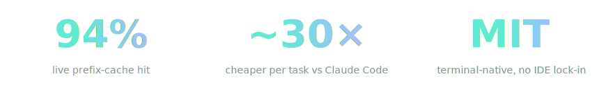
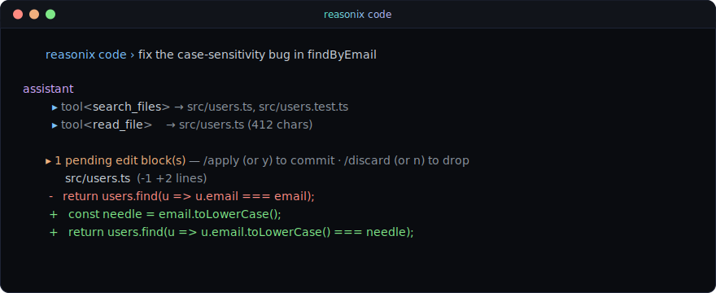
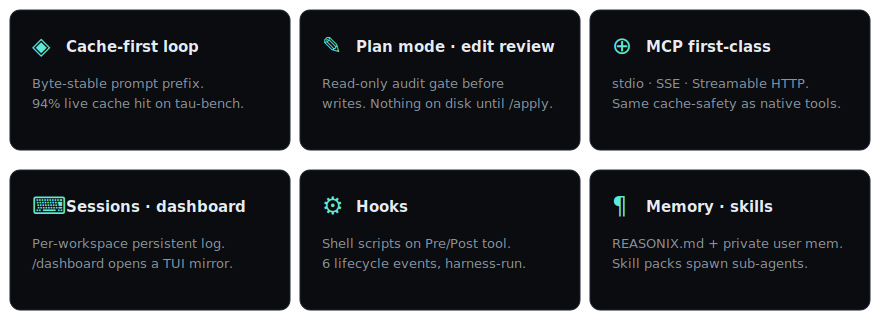

<p align="center">
  
</p>

<p align="center">
  <em>Cache-first agent loop for DeepSeek V4 — terminal-native, MCP first-class, no LangChain.</em>
</p>

<p align="center">
  <strong>English</strong> · <a href="./README.zh-CN.md">简体中文</a> · <a href="https://esengine.github.io/reasonix/">Website</a>
</p>

# Reasonix

[](https://www.npmjs.com/package/reasonix)
[](https://github.com/esengine/reasonix/actions/workflows/ci.yml)
[](./LICENSE)
[](https://www.npmjs.com/package/reasonix)
[](./package.json)

**A DeepSeek-native AI coding agent for your terminal.** Engineered around DeepSeek's prefix-cache, so the savings are real and the loop stays cheap enough to leave on.

<p align="center">
  
</p>

---

## Quick start

```bash
cd my-project
npx reasonix code
```

First run: paste a [DeepSeek API key](https://platform.deepseek.com/api_keys), pick a preset, optionally select MCP servers. Every run after drops you straight in.

<p align="center">
  
</p>

Requires Node ≥ 22. Tested on macOS, Linux, and Windows (PowerShell, Git Bash, Windows Terminal). For per-session prompt customization see `reasonix code --help`.

---

## How it compares

|                                   | Reasonix         | Claude Code     | Cursor             | Aider            |
|-----------------------------------|------------------|-----------------|--------------------|------------------|
| Backend                           | DeepSeek V4      | Anthropic       | OpenAI / Anthropic | any (OpenRouter) |
| **Cost / typical task**           | **~¥0.01–0.04**  | ~¥0.40–4        | ¥150/mo + usage    | varies           |
| License                           | **MIT**          | closed          | closed             | Apache 2         |
| **DeepSeek prefix-cache hit**     | **94%** (live)   | n/a             | n/a                | ~33% (baseline)  |
| Embedded web dashboard            | yes              | —               | n/a (IDE)          | —                |
| Persistent per-workspace sessions | yes              | partial         | n/a                | —                |

Plan mode, edit review, MCP, skills, hooks, and sandboxing are all `yes` for Reasonix and most peers — see the feature grid below for what they actually do here.

Numbers from `benchmarks/tau-bench-lite` (8 multi-turn tasks × 3 repeats, live `deepseek-chat`). [Committed transcripts →](./benchmarks/)

<details>
<summary><strong>Why DeepSeek-only? — the cache economics</strong></summary>

Cheap tokens alone is half the story. DeepSeek's prefix-cache is **byte-stable**: the cache fingerprints from byte 0 of the prompt. Reasonix's loop is engineered around that — append-only growth, no re-ordering, no marker-based compaction — so the cache prefix survives every tool call.

By comparison, Claude Code is built around Anthropic's `cache_control` markers (a fundamentally different mechanic). Pointing it at DeepSeek's Anthropic-compat endpoint keeps the cheap tokens but loses the cache hits — markers are ignored, and the underlying prefix isn't byte-stable. Generic-backend tools (Aider / Cline / Continue) hit the same wall from the other direction: their compaction patterns destroy byte stability.

At DeepSeek's pricing — $0.07/Mtok uncached, $0.014/Mtok cached — **the difference between 50% and 94% hit is roughly 2.5× on input cost alone.** Same model, same API; the loop's invariants are what changed.

A few DeepSeek-specific fixes generic loops miss:

| Generic loops assume | DeepSeek actually does | Reasonix's fix |
|---|---|---|
| Reasoning emitted as a structured `thinking` block | R1 sometimes leaks tool-call JSON inside `<think>` tags | a `scavenge` pass that pulls escaped tool calls back out |
| Tool schemas validated strictly | DeepSeek silently drops deeply-nested object/array params | auto-flatten — nested params get rewritten to single-level prefixed names |
| Tool-call args are well-formed JSON | DeepSeek occasionally produces `string="false"` and other malformed fragments | dedicated `ToolCallRepair` heals the common shapes before dispatch |
| Reasoning depth tuned via system-level switches | V4 exposes a `reasoning_effort` knob (`max` / `high`) | `/effort` slash + `--effort` flag for cheap turns |

Cache stability isn't a feature you turn on; it's an invariant the loop is designed around. That's the entire reason Reasonix is DeepSeek-only.

</details>

---

## What's in the box

<p align="center">
  
</p>

Permissions (`allow` / `ask` / `deny`), tool-call repair (flatten · scavenge · truncation · storm), and `/effort` for cheap turns round out the loop. [Architecture →](./docs/ARCHITECTURE.md) · [Dashboard mockup →](https://esengine.github.io/reasonix/design/agent-dashboard.html) · [TUI mockup →](https://esengine.github.io/reasonix/design/agent-tui-terminal.html) · [Website →](https://esengine.github.io/reasonix/)

---

## Contributing

Reasonix is solo-maintained but designed to grow. Scoped starter tickets — each with background, code pointers, acceptance criteria, and hints — live under the [`good first issue`](https://github.com/esengine/reasonix/labels/good%20first%20issue) label. Pick anything open.

**Open Discussions** — opinions wanted:
- [#20 · CLI / TUI design](https://github.com/esengine/reasonix/discussions/20) — what's broken, what's missing, what would you change?
- [#21 · Dashboard design](https://github.com/esengine/reasonix/discussions/21) — react against the [proposed mockup](https://esengine.github.io/reasonix/design/agent-dashboard.html)
- [#22 · Future feature wishlist](https://github.com/esengine/reasonix/discussions/22) — what would you build into Reasonix next?

**Before your first PR**: read [`CONTRIBUTING.md`](./CONTRIBUTING.md). Short, strict project rules (comments, errors, libraries-over-hand-rolled); `tests/comment-policy.test.ts` enforces the comment ones and `npm run verify` is the pre-push gate.

```bash
git clone https://github.com/esengine/reasonix.git
cd reasonix
npm install
npm run dev code        # run from source via tsx
npm run verify          # lint + typecheck + tests
```

---

## Non-goals

- **Multi-provider flexibility.** DeepSeek-only on purpose — every layer is tuned around DeepSeek's specific cache mechanic and pricing. Coupling to one backend is the feature.
- **IDE integration.** Terminal-first; the diff lives in `git diff`, the file tree in `ls`. The dashboard is a companion, not a Cursor replacement.
- **Hardest-leaderboard reasoning.** Claude Opus still wins some benchmarks. DeepSeek V4 is competitive on coding; if your work is "solve this PhD proof" rather than "fix this auth bug," start with Claude.
- **Air-gapped / fully-free.** DeepSeek's API has free credit on signup but isn't free forever. For air-gapped, see Aider + Ollama or [Continue](https://continue.dev).

---

## License

MIT — see [LICENSE](./LICENSE).
