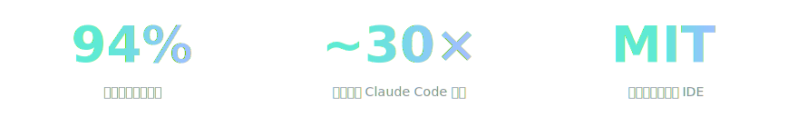
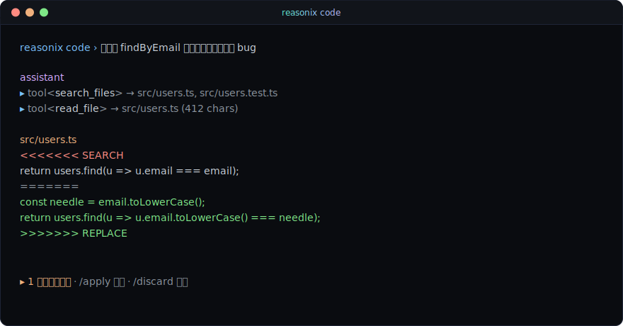
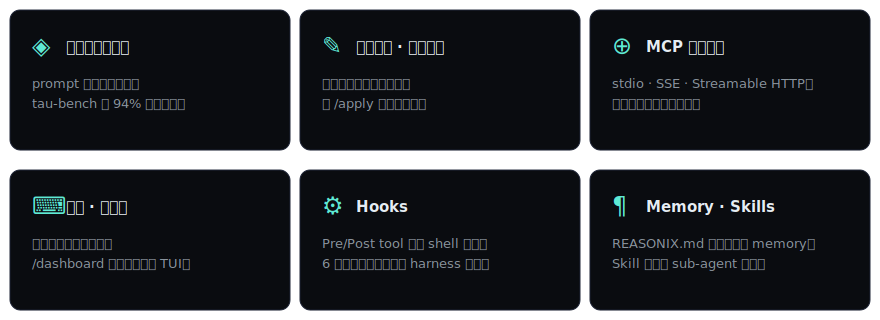

<p align="center">
  
</p>

<p align="center">
  <a href="./README.md">English</a> · <strong>简体中文</strong> · <a href="https://esengine.github.io/reasonix/">官方网站</a>
</p>

<p align="center">
  <a href="https://www.npmjs.com/package/reasonix"></a>
  <a href="https://github.com/esengine/reasonix/actions/workflows/ci.yml"></a>
  <a href="./LICENSE"></a>
  <a href="https://www.npmjs.com/package/reasonix"></a>
  <a href="./package.json"></a>
  <a href="https://github.com/esengine/reasonix/stargazers"></a>
  <a href="https://github.com/esengine/reasonix/discussions"></a>
</p>

<p align="center">
  <strong>DeepSeek 原生的终端 AI 编程代理。</strong> 围绕 DeepSeek 的前缀缓存机制打造——省钱是真省，loop 便宜到可以一直开着。
</p>

<p align="center">
  
</p>

---

## 快速上手

```bash
cd my-project
npx reasonix code   # 首次运行粘贴 DeepSeek API Key，之后会记住
```

<p align="center">
  
</p>

要求 Node ≥ 22。已在 macOS、Linux、Windows（PowerShell · Git Bash · Windows Terminal）测过。[去拿 DeepSeek API Key →](https://platform.deepseek.com/api_keys) · 完整 flag 看 `reasonix code --help`。

---

## 横向对比

|                            | Reasonix          | Claude Code     | Cursor             | Aider             |
|----------------------------|-------------------|-----------------|--------------------|-------------------|
| 后端                       | DeepSeek V4       | Anthropic       | OpenAI / Anthropic | 任意（OpenRouter）|
| **单任务成本**             | **~¥0.01–0.04**   | ~¥0.40–4        | ¥150/月 + 用量     | 不一              |
| 协议                       | **MIT**           | 闭源            | 闭源               | Apache 2          |
| **DeepSeek 前缀缓存命中**  | **94%**（实测）   | 不适用          | 不适用             | ~33%（基线）      |
| 内嵌 web 仪表盘            | 支持              | —               | 不适用 (IDE)       | —                 |
| 持久化的工作区会话         | 支持              | 部分            | 不适用             | —                 |

计划模式、编辑审查、MCP、skill、Hooks、沙箱在 Reasonix 和大多数同类里都是"支持"——具体怎么做的看下面的功能一览。

数据来自 `benchmarks/tau-bench-lite`（8 个多轮任务 × 3 次重放，真实 `deepseek-chat`）。[完整 transcript →](./benchmarks/)

<details>
<summary><strong>为什么只支持 DeepSeek？— 缓存经济学</strong></summary>

便宜的 token 只是故事的一半。DeepSeek 的前缀缓存是**字节稳定**的：缓存指纹从 prompt 第 0 字节开始算。Reasonix 整个循环都围绕这一点设计——只追加、不重排、不做基于标记的 compaction，所以缓存前缀能跨过每一次工具调用存活下来。

对比一下：Claude Code 是围绕 Anthropic 的 `cache_control` 标记构建的（完全不同的机制）。把 Claude Code 指向 DeepSeek 的 Anthropic 兼容端点，能拿到便宜的 token，但缓存命中没了——标记被忽略，底下的前缀本来就不字节稳定。通用后端工具（Aider / Cline / Continue）从另一个方向撞上同一堵墙：它们的 compaction 模式会破坏字节稳定。

按 DeepSeek 的定价 —— $0.07/Mtok 未命中、$0.014/Mtok 命中 —— **50% 命中和 94% 命中之间的差距，光是输入成本就大约 2.5 倍。** 同模型、同 API；变的只是循环本身的不变量。

通用循环漏掉的几个 DeepSeek 专属修复：

| 通用循环假设的 | DeepSeek 实际表现 | Reasonix 的处理 |
|---|---|---|
| reasoning 在结构化的 `thinking` 块里 | R1 偶尔把 tool-call JSON 漏在 `<think>` 标签里 | 一个 `scavenge` pass 把逃逸的 tool call 拉回来 |
| 工具 schema 严格校验 | DeepSeek 会静默丢掉深层嵌套的 object/array 参数 | 自动 flatten——嵌套参数被改写成单层带前缀的名字 |
| tool-call 参数是合法 JSON | DeepSeek 偶尔吐 `string="false"` 之类的破碎片段 | 专门的 `ToolCallRepair` 在 dispatch 前把常见形状修好 |
| reasoning 深度靠系统级开关调 | V4 暴露了 `reasoning_effort` 旋钮（`max` / `high`） | `/effort` 斜杠 + `--effort` flag，便宜回合可以降档 |

缓存稳定不是个开关，是循环要围绕设计的不变量。这就是 Reasonix 只支持 DeepSeek 的根本原因。

</details>

---

## 功能一览

<p align="center">
  
</p>

权限系统（`allow` / `ask` / `deny`）、tool-call repair（flatten · scavenge · truncation · storm）、`/effort` 给便宜回合降档——一起把整个 loop 兜起来。[架构文档 →](./docs/ARCHITECTURE.md) · [Dashboard 设计稿 →](https://esengine.github.io/reasonix/design/agent-dashboard.html) · [TUI 设计稿 →](https://esengine.github.io/reasonix/design/agent-tui-terminal.html) · [官网 →](https://esengine.github.io/reasonix/)

---

## 参与贡献

Reasonix 现在主要是单人维护，但是为协作设计的。给新手准备的入门 issue —— 每个都带背景说明、代码定位、验收标准、提示 —— 全部挂在 [`good first issue`](https://github.com/esengine/reasonix/labels/good%20first%20issue) 标签下。挑任意一个还没人认领的就行。

**正在征集意见的 Discussions：**
- [#20 · CLI / TUI 设计](https://github.com/esengine/reasonix/discussions/20) — 哪里坏了、哪里少东西、哪里你会怎么改？
- [#21 · Dashboard 设计](https://github.com/esengine/reasonix/discussions/21) — 对着[设计稿](https://esengine.github.io/reasonix/design/agent-dashboard.html)拍砖
- [#22 · 未来功能愿望单](https://github.com/esengine/reasonix/discussions/22) — 你希望 Reasonix 长出什么功能？

**第一次提 PR 之前**：先读 [`CONTRIBUTING.md`](./CONTRIBUTING.md) —— 短小、严格的项目规则（注释、错误处理、用现成库不手写）。`tests/comment-policy.test.ts` 静态强制执行注释那部分，`npm run verify` 是 push 前的闸。参与本项目即同意 [行为准则](./CODE_OF_CONDUCT.md)。安全相关问题请走 [SECURITY.md](./SECURITY.md)。

### 贡献者

<a href="https://github.com/esengine/reasonix/graphs/contributors">
  
</a>

---

## 不做的事

- **多供应商灵活性。** 故意只做 DeepSeek —— 每一层都为 DeepSeek 特定的缓存机制和定价调过。绑死一个后端是 feature，不是要克服的限制。
- **IDE 集成。** 终端优先；diff 在 `git diff`，文件树在 `ls`。仪表盘是 TUI 的伴生，不是 Cursor 的替代。
- **追最难的 reasoning 榜单。** Claude Opus 在某些榜单上还是赢家。DeepSeek V4 在编程任务上有竞争力；如果你的工作是"解一个 PhD 级证明"而不是"修个 auth bug"，先用 Claude。
- **完全离线 / 永远免费。** Reasonix 需要付费的 DeepSeek API Key。要离线 / 零成本，看 Aider + Ollama 或 [Continue](https://continue.dev)。

---

## 协议

MIT —— 见 [LICENSE](./LICENSE)。
